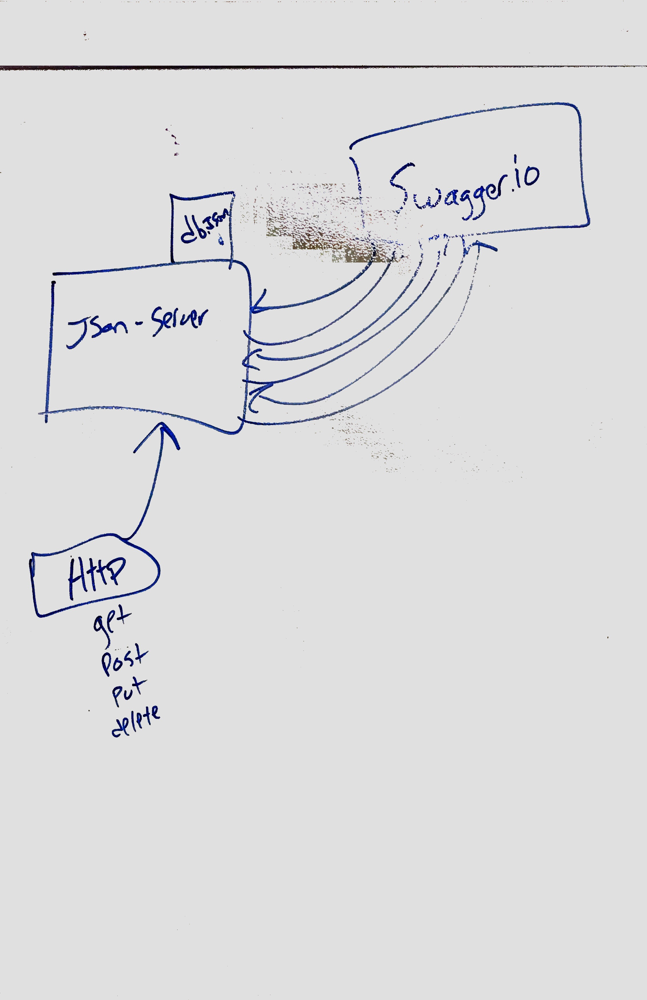

# LAB - 06

## HTTP and REST

### Author: Brandyn Vay

### Links and Resources
* [submission PR](https://github.com/brandyn-vay-401-advanced-javascript/lab-class-06/pull/1)
* [swagger](https://app.swaggerhub.com/apis/KlNGU/default-title/0.1)
* [back-end](http:localhost:3000) (when applicable)
* [front-end](https://codesandbox.io/s/api-client-rzki2) (when applicable)

#### Documentation
* [api docs](./docs/swagger.json) (API servers)

#### UML
